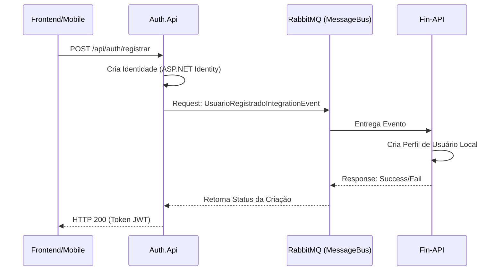

# Fin-API 💰

Fin-API é uma API RESTful desenvolvida em **.NET 10** para gerenciamento de finanças pessoais. Este projeto faz parte de um ecossistema distribuído, integrando-se com serviços de autenticação e mensageria para garantir consistência de dados e segurança robusta.

---

## 🏗️ Ecossistema e Integrações

A `Fin-API` não opera isoladamente. Ela depende e interage com dois outros componentes principais do ecossistema:

### 1. 🔐 Auth.Api (Serviço de Autenticação)
Responsável por toda a gestão de identidade, login e emissão de tokens JWT.
*   **Dependência:** A `Fin-API` utiliza os tokens JWT emitidos pela `Auth.Api` para autorizar requisições.
*   **Sincronização:** Quando um usuário se cadastra na `Auth.Api`, uma mensagem de integração é enviada para a `Fin-API` para que o perfil local do usuário seja criado.

### 2. 🚌 Jovane.MessageBus (Mensageria)
Biblioteca central que abstrai a comunicação via **RabbitMQ**.
*   **Papel:** Facilita a comunicação assíncrona entre o serviço de autenticação e a API financeira.
*   **Padrão:** Utiliza o padrão **Request/Response** para garantir que o usuário seja criado com sucesso na base financeira antes de confirmar o registro no serviço de identidade.

---

## 🚀 Tecnologias Utilizadas

*   **Platform:** [.NET 10.0](https://dotnet.microsoft.com/)
*   **Database:** [PostgreSQL](https://www.postgresql.org/) (via Entity Framework Core)
*   **ORM:** [Entity Framework Core](https://docs.microsoft.com/en-us/ef/core/)
*   **Authentication:** JWT (JSON Web Token) validado via ASP.NET Core Identity
*   **Messaging:** RabbitMQ (via biblioteca `Jovane.MessageBus`)
*   **Documentation:** Swagger / OpenAPI
*   **Logging:** Serilog
*   **Object Mapping:** AutoMapper
*   **Validation:** FluentValidation

---

## 🏗️ Arquitetura do Sistema

O projeto adota uma arquitetura em camadas focada em desacoplamento:

*   **Controllers:** Portas de entrada HTTP. Validam o estado básico e delegam para os serviços.
*   **Services:** Camada de lógica de negócio. Realizam validações complexas e interagem com a camada de dados.
*   **Integration Handlers:** `RegistroUsuarioIntegrationHandler` atua como um consumer de background, escutando eventos do Message Bus.
*   **Repositories:** Abstração de acesso ao PostgreSQL.
*   **Notification Pattern:** Gerenciamento de erros sem o uso de exceções custosas.

### Diagrama de Fluxo de Integração



---

## 🔌 Endpoints Principais

A API utiliza **Claims-Based Authorization**. O token JWT deve conter as permissões específicas (ex: `FIN:TRN_LER`) para acessar os recursos.

### 👤 Usuários (`/api/usuarios`)
| Método | Rota | Descrição |
| :--- | :--- | :--- |
| `GET` | `/` | Retorna os dados do usuário atual (baseado no ID do Token). |

### 🏷️ Categorias (`/api/categories`)
| Método | Rota | Descrição | Permissão Requerida |
| :--- | :--- | :--- | :--- |
| `GET` | `/` | Lista categorias do usuário. | `FIN:CTG_LER` |
| `POST` | `/` | Cria nova categoria. | `FIN:CTG_CRIAR` |
| `PUT` | `/atualizar/{id}` | Atualiza categoria. | `FIN:CTG_CRIAR` |
| `DELETE` | `/{id}` | Remove categoria. | `FIN:CTG_EXCLUIR` |

### 💸 Transações (`/api/transacoes`)
| Método | Rota | Descrição | Permissão Requerida |
| :--- | :--- | :--- | :--- |
| `GET` | `/saldo` | Saldo total consolidado. | `FIN:TRN_LER` |
| `GET` | `/periodo` | Filtro por data. | `FIN:TRN_LER` |
| `POST` | `/novo` | Registra entrada/saída. | `FIN:TRN_CRIAR` |
| `DELETE` | `/{id}` | Estorna transação. | `FIN:TRN_EXCLUIR` |

---

## ⚙️ Configuração de Ambiente

Para que a integração funcione, os segredos de JWT e as URLs do RabbitMQ devem estar sincronizados entre os serviços.

### AppSettings Sync
```json
{
  "ConnectionStrings": {
    "DefaultConnection": "Host=localhost;Database=FinDb;..."
  },
  "JwtSettings": {
    "Segredo": "MESMA_CHAVE_DO_AUTH_API",
    "Emissor": "AuthApi",
    "Audiencia": "FinFront"
  },
  "RabbitMQ": {
    "Host": "localhost"
  }
}
```

---

## 🛠️ Como Executar o Ecossistema

1.  **Suba a infraestrutura:** Certifique-se de que o **PostgreSQL** e o **RabbitMQ** estão rodando.
2.  **Inicie a Auth.Api:** Necessária para o fluxo de registro e login.
3.  **Inicie a Fin-API:**
    ```bash
    dotnet restore
    dotnet ef database update
    dotnet run
    ```
4.  **Fluxo de Teste:** Registre um usuário via `Auth.Api`. Verifique no log da `Fin-API` o recebimento da mensagem de integração.

---

## 📋 Requisitos para Implementação de Nova Autenticação

Caso deseje substituir a `Auth.Api`, o novo serviço deve:
1.  Emitir um JWT contendo a claim `sub` (ou o ID do usuário) e as permissões no formato `FIN:XXXX`.
2.  Enviar um `UsuarioRegistradoIntegrationEvent` via RabbitMQ para a fila esperada pelo `RegistroUsuarioIntegrationHandler`, garantindo que a `Fin-API` conheça o novo `UserId`.

---

## 📝 Licença

Desenvolvido para fins de estudo por **Jovane Sousa**.
